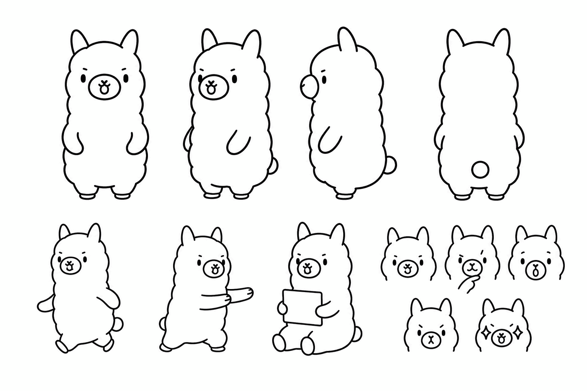
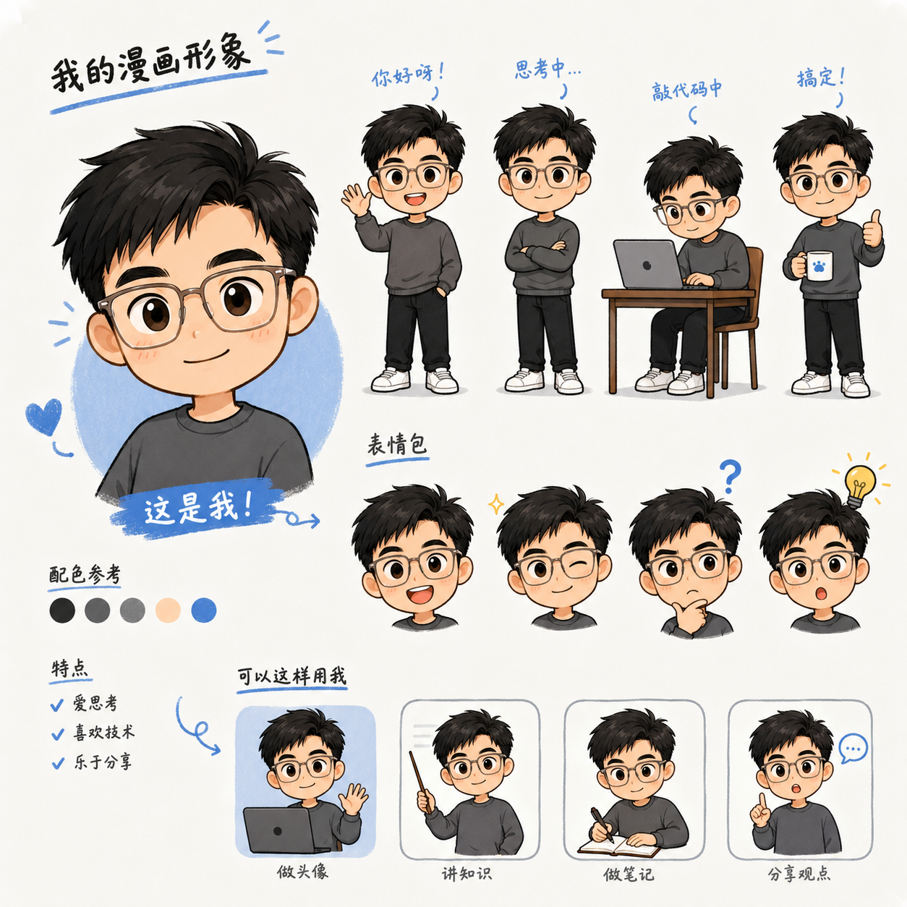
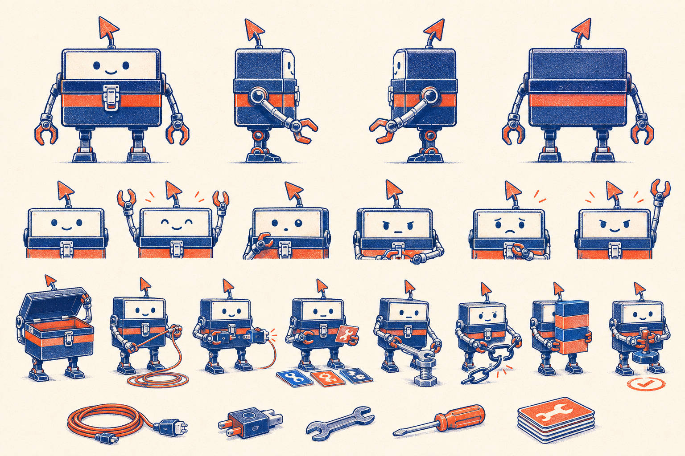
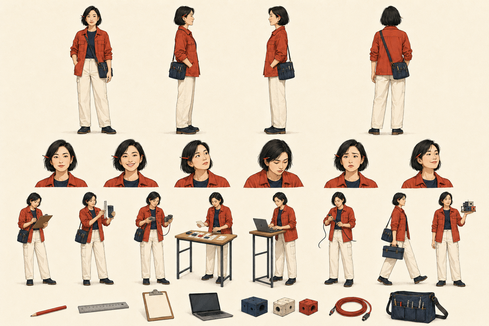
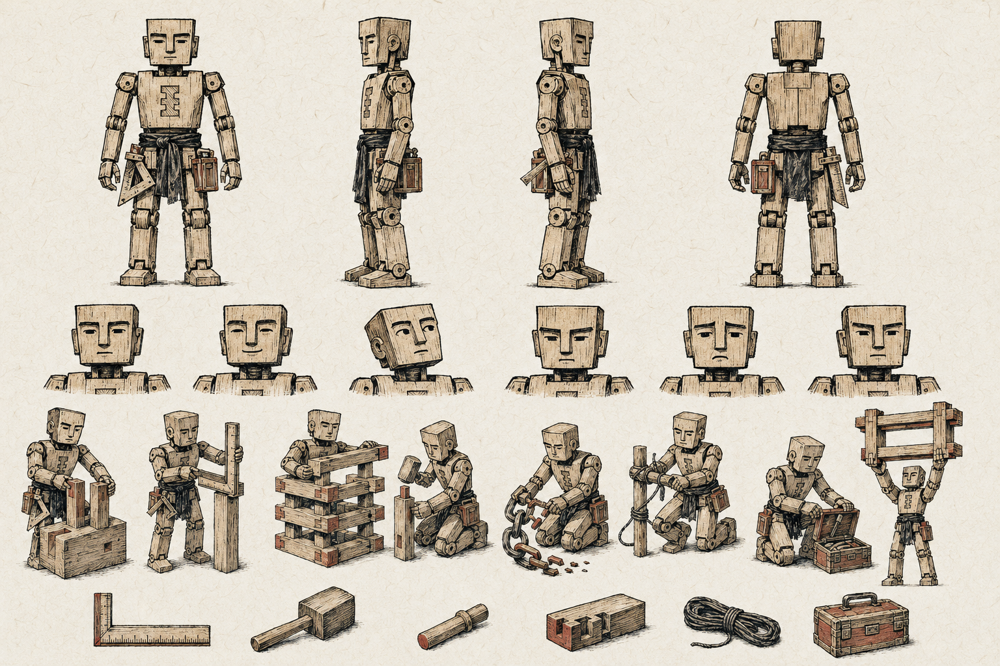
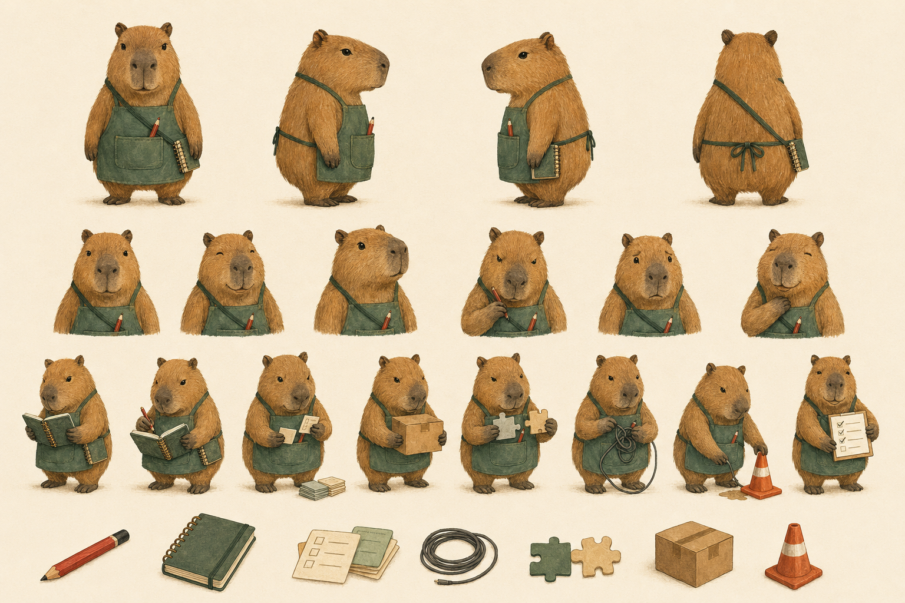

# xhs-imagen

[English](./README.en.md)

> 输入一个主题，生成一套可发布的小红书图文：调研、文案、分镜、角色一致性生图、发布前 QA，一次完成。

`xhs-imagen` 是一个跨 Agent 的小红书图文生成技能。它不只负责“写一段生图 Prompt”，而是把内容准确性、移动端阅读体验、系列叙事、角色一致性和成品检查放进同一条工作流。

Claude Code、OpenCode、OpenClaw、Hermes、Codex，以及其他能够读取 `SKILL.md` 并调用本地脚本或生图工具的 Agent 都可以使用。

## 能做什么

- 从主题、文章、文档或粗略想法开始，先调研并核验事实
- 生成小红书标题、正文、标签和完整图文叙事
- 用“认知锚点”筛选值得独立成页的内容，而不是机械分页
- 为每页设计原创视觉隐喻，让角色真正参与核心动作
- 自动生成 3:4 封面和 9:16 内页
- 在 6 套绑定角色与画风的 `visual_profile` 中选择
- 有生图工具时优先调用模型；没有时使用本地 SVG → PNG 降级方案
- 逐张检查文字、构图、比例、角色漂移和事实准确性
- 默认不在图片中显示页码，发布时可自由调整顺序

## 快速开始

```bash
git clone https://github.com/NimaChu/xhs-imagen.git
cd xhs-imagen
```

根据所用 Agent 的技能目录约定安装仓库，或者直接让 Agent 读取根目录的 `SKILL.md`。

支持 `$skill-name` 调用的 Agent 可以直接使用：

```text
使用 $xhs-imagen，先调研“RAG 为什么不是给模型安装知识”，
再生成一张 3:4 封面、6 张 9:16 小红书科普图和可发布正文。
```

也可以指定视觉档案：

```text
使用 $xhs-imagen，以 toolbox-bot-risograph 风格，
制作一期“10 个值得安装的 Codex 插件”小红书图文。
```

不支持 `$skill-name` 时，直接要求 Agent 读取本仓库的 `SKILL.md` 即可。

## 6 套角色与绘画风格

每个 `visual_profile` 都把角色身份、绘画媒介、配色、适用题材和防漂移规则绑定在一起。生成时只传入所选档案的一张 `character-sheet.png`，避免多个角色或画风互相污染。

<table>
  <tr>
    <td width="50%" valign="top">
      <strong>alpaca-line-art（默认）</strong><br>
      白色羊驼创作者 × 极简黑线手绘。适合清爽科普、概念解释和轻量观点。
      <br><br>
      
    </td>
    <td width="50%" valign="top">
      <strong>glasses-chibi-blue</strong><br>
      眼镜漫画主持人 × 钴蓝知识漫画。适合小白教育和信息稍密的知识卡片。
      <br><br>
      
    </td>
  </tr>
  <tr>
    <td width="50%" valign="top">
      <strong>toolbox-bot-risograph</strong><br>
      工具箱机器人 × 双色孔版印刷。适合 Codex、插件、Skill、Agent 和工作流。
      <br><br>
      
    </td>
    <td width="50%" valign="top">
      <strong>maker-girl-editorial</strong><br>
      成年女工程师 × 现代杂志编辑插画。适合 AI Coding、职场教程和观点内容。
      <br><br>
      
    </td>
  </tr>
  <tr>
    <td width="50%" valign="top">
      <strong>cyber-luban-woodcut</strong><br>
      鲁班木偶工匠 × 新中式木刻版画。适合 Skill–Harness–Agent 架构和系统搭建。
      <br><br>
      
    </td>
    <td width="50%" valign="top">
      <strong>capybara-gouache</strong><br>
      水豚运营官 × 温暖不透明水粉。适合小白科普、避坑、清单和生活化类比。
      <br><br>
      
    </td>
  </tr>
</table>

角色资产统一位于：

```text
assets/characters/<profile-id>/character-sheet.png
```

每张角色表包含多视图、表情、核心动作和固定道具，可直接作为跨页角色参考图。

## 从主题到发布的工作流

1. **明确任务**：确定受众、目标、页数、语言和视觉档案。
2. **调研核验**：优先检查时效性、产品信息、数字、归因和争议性表述。
3. **筛选认知锚点**：保留真正改变读者理解的判断、转折、对比、误区和边界。
4. **设计视觉隐喻**：把抽象概念转换成物理动作和日常物件。
5. **让角色承担动作**：角色必须连接、拆解、搬运、修复或揭示核心关系，而不是站在角落装饰。
6. **先做视觉样张**：先生成封面和一张代表性内页，通过后锁定画风与角色。
7. **生成整套并 QA**：逐张检查比例、文字、构图、事实和角色一致性，发现问题后修复并复检。

## 默认输出

```text
output/<topic-slug>/
├── project.json
├── research.md
├── post.md
├── storyboard.md
├── prompts/
│   ├── 00-cover.md
│   └── 01-*.md
├── images/
│   ├── cover.png
│   └── page-01.png
└── qa-report.md
```

| 图片 | 比例 | 推荐尺寸 |
|---|---:|---:|
| 封面 | 3:4 | 1080 × 1440 |
| 内页 | 9:16 | 1080 × 1920 |

默认生成 1 张封面和 5–8 张内页，一页只解释一个主概念。

## 两条渲染路径

| 条件 | 执行方式 | 结果特点 |
|---|---|---|
| Agent 有生图工具 | 使用所选 visual profile 的唯一角色参考图调用生图模型 | 插画表现力强，适合直接发布 |
| Agent 没有生图工具 | 使用本地 SVG → PNG 渲染器 | 中文稳定、可复现，作为完整知识卡降级方案 |

仅当用户明确指出现有图片文字错误或不可读时，才使用局部 SVG 文字修复；主流程不会为预防错字而提前拆分文字和插画。

## 本地工具

校验项目：

```bash
python3 scripts/validate_project.py references/project.template.json
```

生成生图模型逐页 Prompt：

```bash
python3 scripts/make_prompt_pack.py \
  references/project.template.json \
  --output-dir output/demo/prompts
```

本地渲染：

```bash
python3 scripts/render_xiaohongshu_project.py \
  references/project.template.json \
  --output-dir output/demo
```

只生成本地渲染 Prompt：

```bash
python3 scripts/render_xiaohongshu_project.py \
  references/project.template.json \
  --output-dir output/demo \
  --prompts-only
```

本地渲染会依次尝试 `rsvg-convert`、Inkscape、macOS `sips` / `qlmanage`、ImageMagick，或 `FREE_IMAGEGEN_EXPORT_SCRIPT` 指定的导出器。

## 添加自己的角色

1. 新建 `assets/characters/<profile-id>/character-sheet.png`。
2. 在 `references/visual-profiles.json` 中加入角色身份、风格锁、负向约束和背景色。
3. 在 `references/character-consistency.md` 中写明不可变特征与漂移检查。
4. 运行项目校验和测试。

角色与画风应作为一个不可拆分的 profile 维护；每个 profile 只保留一张角色参考图。

## 测试

```bash
python3 -m unittest discover -s tests -v
python3 scripts/validate_project.py references/project.template.json
python3 scripts/make_prompt_pack.py references/project.template.json --output-dir /tmp/xhs-prompts
python3 scripts/render_xiaohongshu_project.py references/project.template.json --output-dir /tmp/xhs-render --prompts-only
```

## 兼容性

原 `scripts/free_image_gen.py` CLI 和 Story Plan 接口继续保留，已有本地工作流仍可使用。`agents/openai.yaml` 仅提供支持该元数据格式的客户端界面信息，不限制其他 Agent 使用本技能。

## License

MIT
